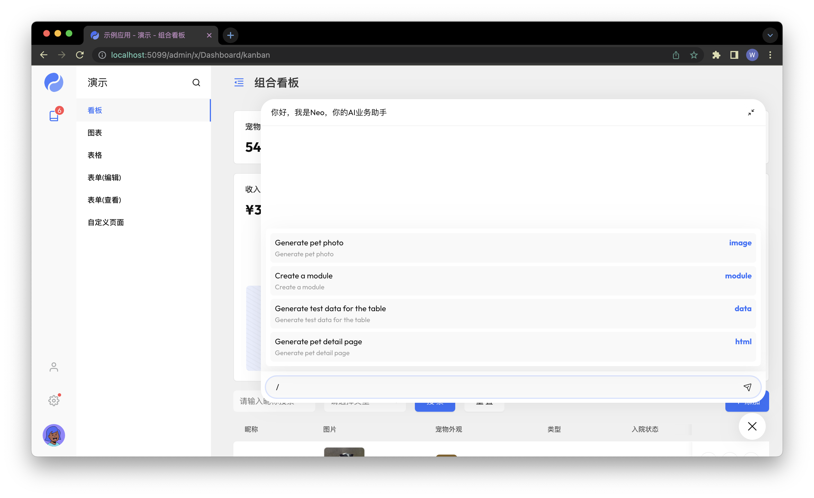

# Neo Example



Example of an AI assistant.

See [documentation](https://yaoapps.com/doc/%E4%BB%8B%E7%BB%8D/%E5%85%A5%E9%97%A8%E6%8C%87%E5%8D%97) for more details.

**Install Yao Command**

Skip this step if the yao command has already been installed.

See [Install](https://yaoapps.com/doc/%E4%BB%8B%E7%BB%8D/%E5%AE%89%E8%A3%85%E8%B0%83%E8%AF%95) for more details.

**Download Source Code**

```bash
git clone https://github.com/YaoApp/yao-examples.git
cd yao-examples/neo
```

**Replace Environment Variables**

```bash
cp env-sample.env .env

# REPLACE THE ENVIRONMENT VARIABLES TO YOUR OWN SETTINGS
# 修改为你自己的配置
# ...
```

**Migrate & Make Demo Data**

```bash
yao migrate --reset && yao run scripts.setup.Data
```

**Server Start**

```bash
yao start
```

## Default Admin Account

|          |                  |
| -------- | ---------------- |
| User     | `xiang@iqka.com` |
| Password | `A123456p+`      |

## ENVIRONMENT VARIABLES

`.env` file

```bash
#
# REPLACE THE FOLLOWING ENVIRONMENT VARIABLES TO YOUR OWN SETTINGS
# COPY THIS FILE TO .env
#
# 修改为你自己的配置
# 重命名为 .env
#

## YAO Settings
## REPLACE /data/app WITH YOUR OWN APPLICATION DIRECTORY
## 将 /data/app 替换为你自己的应用目录

# Yao Server
YAO_ENV="development"
YAO_LANG="zh-cn"
YAO_HOST="0.0.0.0"
YAO_PORT="5099"
YAO_LOG_MODE="TEXT"
YAO_LOG="/data/app/logs/application.log"
YAO_JWT_SECRET="bLp@bi!oqo-2U+hoTRUG"

# Database
YAO_DB_DRIVER="sqlite3"
YAO_DB_PRIMARY="/data/app/db/yao.db"

# Session Store
YAO_SESSION_FILE="/data/app/db/.session"
YAO_SESSION_STORE="file"

# Studio API Server
YAO_STUDIO_PORT="5077"
YAO_STUDIO_SECRET="699DA521C2CBA38CFFF4626241689736E2ED65D77696FE56A3D58F5CB9C24C87"


## OpenAI
## REPLACE TO YOUR OWN OPENAI KEY
## 替换为你自己的 OpenAI KEY
OPENAI_KEY=sk-xxxxxx

## Stable Diffusion
## INSTALL STABLE DIFFUSION FROM https://github.com/AUTOMATIC1111/stable-diffusion-webui
## SD Arguments: --api --nowebui
## REPLACE TO YOUR OWN STABLE DIFFUSION API SETTINGS
## 安装 Stable Diffusion
## 替换为你自己的 Stable Diffusion 配置
## SD 启动参数: --api --nowebui
SD_HOST=http://127.0.0.1:7861
SD_USER=demo
SD_PASS=123456

```
